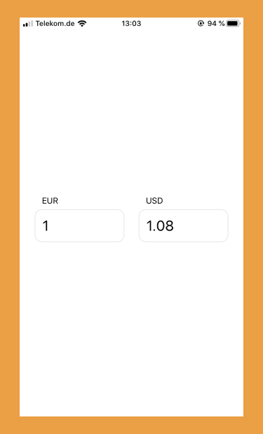

## Bored at home? Learn how to build a app from scratch using React Native.

**In this multipart series we'll develop a native app from Scratch. This second part we'll start building the main functionalities of our app. We'll be able to enter some values, fetch data and show the calculated results.**

Let's learn how to build a native app together. We'll build a currency convertor. In the [first part](../build-an-app-01/) of this series I layed out why I think this is a good example and learning app. The also started our journey by setting up our dev environment, consisting of React Native and Expo. We started with a blank Expo template. This is where we'll start from now. Also, in case you want to skip ahead, I'll have a [GitHub repo](https://github.com/kriswep/currency/tree/part2) with what we'll end up today.

Motivated? As a sneak peak, this will be today's endresult. Not too much, but it'll be fully working and will convert currencies.



### Start Building

First things first: After setting up the dev environment using Expo before, we now need to install the npm modules we need. For now, that's just one, [React Query](https://github.com/tannerlinsley/react-query) as our data fetching helper: `npm i -S react-query`.

To keep things simple and since we only started out, we'll add all our code in the main `App.js` file for now. Later on we can worry about file setup and splitting the right components apart.

Our app will be a currency convertor. The user will enter a base amount in their currency, and get the corresponding amount in another currency. As such, we'll need some input fields to select currencies and enter values. Also, we have to know the actual exchange rates to calculate the foreign currency amount.

### Fetch Data

Let's start with fetching the current exchange rates. A nice API to get that, is the [Rates API](http://ratesapi.io/). It's fast and doesn't need any registration or key to use.

Start your dev script with `npm run start`, open your project in the Expo simulator on your mobile device and start working in the file `App.js`. Change its' content to the following:

```jsx
// App.js
import React from 'react';
import { StyleSheet, Text, View } from 'react-native';
import { useQuery } from 'react-query';

/**
 * Our main App component
 */
export default function App() {
  /* use useQuery from React Query, to get the latest exchange rates */
  const { _, data, error } = useQuery(
    ['latest', 'EUR', 'USD'],
    fetchCurrencies,
  );

  return (
    <View style={styles.container}>
      {error && <Text>Uh Oh, an error happened...</Text>}
      {/* Let's see what we got */}
      {data && <Text>{JSON.stringify(data.rates)}</Text>}
    </View>
  );
}

/* The fetcher function used by React Query: A fetch from the API, returning its' response */
const fetchCurrencies = async (_, base, target) => {
  const res = await fetch(
    `https://api.ratesapi.io/api/latest?base=${base}&symbols=${target}`,
  );

  return await res.json();
};

/* The styles for our app */
const styles = StyleSheet.create({
  container: {
    flex: 1,
    flexDirection: 'row',
    backgroundColor: '#fff',
    alignItems: 'center',
    justifyContent: 'center',
  },
});
```

The interesting parts of our code are the useQuery function call, which React Query provides for us, in tandem with a fetcher function we wrote. The fetcher function makes a call to our API and returns its response. React Query takes over from here and helps us with caching that.

For now, we only render the current rate for Euro to US Dollar on the screen with some minimal styling. Let's expand on that and build our app.

### Render the UI

We need two inputs for the currencies we want to convert from and to, and two inputs for the corresponding values. React Native gives us the TextInput primitive for that. We also need some state for our inputs. We'll rely on React `useState` and `useEffect` hooks for that.

Let's extend our main App.js.

```jsx
// App.js
import React, { useState, useEffect } from 'react';
import { StyleSheet, Text, TextInput, View } from 'react-native';
import { useQuery } from 'react-query';

/**
 * Our main App component
 */
export default function App() {
  const [base, setBase] = useState('EUR');
  const [target, setTarget] = useState('USD');

  const [baseAmount, setBaseAmount] = useState('1');
  const [targetAmount, setTargetAmount] = useState('0');

  /**
   * use useQuery from React Query, to get the latest exchange rates.
   * Instead of fixed currencies we use our state
   */
  const { _, data, error } = useQuery(
    ['latest', base, target],
    fetchCurrencies,
  );

  /*
   * Improved UI, with Inputs to enter the needed values
   */
  return (
    <View style={styles.container}>
      {/* Minor error management, enough for our use case */}
      {error && <Text>Uh Oh, an error happened...</Text>}
      <>
        <View style={styles.currencyContainer}>
          {/* The input to enter the base currency */}
          <TextInput
            autoCapitalize="characters"
            style={styles.currency}
            value={base}
            onChangeText={setBase}
          />
          {/* The input to enter the base value, 
              we're omitting onChangeText for now */}
          <TextInput
            style={styles.currencyAmount}
            keyboardType="numeric"
            value={baseAmount}
          />
        </View>
        <View style={styles.currencyContainer}>
          {/* The input to enter the target currency */}
          <TextInput
            autoCapitalize="characters"
            style={styles.currency}
            value={target}
            onChangeText={setTarget}
          />
          {/* The input to display the target value, 
              we're omitting onChangeText for now */}
          <TextInput
            style={styles.currencyAmount}
            keyboardType="numeric"
            value={targetAmount}
          />
        </View>
      </>
    </View>
  );
}

/**
 * The fetcher function used by React Query: A fetch from the API, returning its' response
 * Same as before
 */
const fetchCurrencies = async (_, base, target) => {
  const res = await fetch(
    `https://api.ratesapi.io/api/latest?base=${base}&symbols=${target}`,
  );

  return await res.json();
};

// We'll also extend our styles, we want our Inputs centered and with enough space
const styles = StyleSheet.create({
  container: {
    flex: 1,
    flexDirection: 'row',
    backgroundColor: '#fff',
    alignItems: 'center',
    justifyContent: 'center',
  },

  currencyContainer: {
    flexBasis: 150,
    margin: 12,
  },
  currency: {
    paddingHorizontal: 12,
    paddingVertical: 6,
  },
  currencyAmount: {
    fontSize: 24,
    padding: 12,
    borderStyle: 'solid',
    borderWidth: 1,
    borderColor: '#e2e2e2',
    borderRadius: 12,
  },
});
```

What happened? After importing what we need, we start by declaring the state we need in our `App` function. That's the `base` and `target` currencies, as well as the `baseAmount` and `targetAmount`. We also extended our render. There is some minimal error handling and the needed `TextInput`s. The way we set it up, you can already enter currencies, which will trigger network request to the exchange rate API. That's good, the can now start converting.

Note we're not finished yet. There are no handlers for changes in the value inputs, and also no functions to actually convert. Let's change that.

TODO: Check code block formatting options https://stephenweiss.dev/blog/2020-01-15/syntax-highlighting-prismjs-gatsby/

```javascript{numberLines: true}
// App.js
import React, { useState, useEffect } from 'react';
-import { StyleSheet, Text, TextInput, View } from 'react-native';
+import { useQuery } from 'react-query';

export default function App() { // highlight-line
  const [base, setBase] = useState('EUR');
  const [target, setTarget] = useState('USD');

  const [baseAmount, setBaseAmount] = useState('1');
  const [targetAmount, setTargetAmount] = useState('0');

  const { _, data, error } = useQuery(
    ['latest', base, target],
    fetchCurrencies,
  );

  /**
   * Convert when data changes, e.g. on start
   */
  useEffect(() => calculateFromBase(baseAmount), [data]);

  /**
   * When the first value (base) is changed, calculate the second
   * with the rate retrieved from the API
   */
  const calculateFromBase = number => {
    if (!isNaN(number) && data && data.rates) {
      setBaseAmount(number);
      const newTargetAmount = (number * data.rates[target]).toFixed(2);
      setTargetAmount(isNaN(newTargetAmount) ? 0 : newTargetAmount);
    }
  };

  /**
   * When the second value (target) is changed, calculate the first
   * with the rate retrieved from the API
   */
  const calculateFromTarget = number => {
    if (!isNaN(number) && data && data.rates) {
      const newBaseAmount = (number / data.rates[target]).toFixed(2);
      setBaseAmount(isNaN(newBaseAmount) ? 0 : newBaseAmount);
      setTargetAmount(number);
    }
  };

  return (
    <View style={styles.container}>
      {error && <Text>Uh Oh, an error happened...</Text>}

      <>
        <View style={styles.currencyContainer}>
          <TextInput
            autoCapitalize="characters"
            style={styles.currency}
            value={base}
            onChangeText={setBase}
          />
          {/* The input to enter the base value,
              onChangeText calls our function to convert the second (target) value */}
          <TextInput
            style={styles.currencyAmount}
            keyboardType="numeric"
            value={baseAmount}
            onChangeText={calculateFromBase}
          />
        </View>
        {/* The input to enter the target value,
              onChangeText calls our function to convert the first (base) value */}
        <View style={styles.currencyContainer}>
          <TextInput
            autoCapitalize="characters"
            style={styles.currency}
            value={target}
            onChangeText={setTarget}
          />
          <TextInput
            style={styles.currencyAmount}
            keyboardType="numeric"
            value={targetAmount}
            onChangeText={calculateFromTarget}
          />
        </View>
      </>
    </View>
  );
}

// same as before
const fetchCurrencies = async (_, base, target) => {
  const res = await fetch(
    `https://api.ratesapi.io/api/latest?base=${base}&symbols=${target}`,
  );

  return await res.json();
};

const styles = StyleSheet.create({
  container: {
    flex: 1,
    flexDirection: 'row',
    backgroundColor: '#fff',
    alignItems: 'center',
    justifyContent: 'center',
  },

  currencyContainer: {
    flexBasis: 150,
    margin: 12,
  },
  currency: {
    paddingHorizontal: 12,
    paddingVertical: 6,
  },
  currencyAmount: {
    fontSize: 24,
    padding: 12,
    borderStyle: 'solid',
    borderWidth: 1,
    borderColor: '#e2e2e2',
    borderRadius: 12,
  },
});
```

.. TODO: Explain changes

### Done

So, we finished the main functionality of our app. We can specify currencies, enter values and see the converted amount. In the background we fetch the needed exchange rates from an external API.

As a reference, this is what we landed on today:

```jsx
// App.js
import React, { useState, useEffect } from 'react';
import { StyleSheet, Text, TextInput, View } from 'react-native';
import { useQuery } from 'react-query';

/**
 * Our main App component
 */
export default function App() {
  const [base, setBase] = useState('EUR');
  const [target, setTarget] = useState('USD');

  const [baseAmount, setBaseAmount] = useState('1');
  const [targetAmount, setTargetAmount] = useState('0');

  /**
   * use useQuery from React Query, to get the latest exchange rates.
   * Instead of fixed currencies we use our state
   */
  const { _, data, error } = useQuery(
    ['latest', base, target],
    fetchCurrencies,
  );

  /**
   * Convert when data changes, e.g. on start
   */
  useEffect(() => calculateFromBase(baseAmount), [data]);

  /**
   * When the first value (base) is changed, calculate the second
   * with the rate retrieved from the API
   */
  const calculateFromBase = number => {
    if (!isNaN(number) && data && data.rates) {
      setBaseAmount(number);
      const newTargetAmount = (number * data.rates[target]).toFixed(2);
      setTargetAmount(isNaN(newTargetAmount) ? 0 : newTargetAmount);
    }
  };

  /**
   * When the second value (target) is changed, calculate the first
   * with the rate retrieved from the API
   */
  const calculateFromTarget = number => {
    if (!isNaN(number) && data && data.rates) {
      const newBaseAmount = (number / data.rates[target]).toFixed(2);
      setBaseAmount(isNaN(newBaseAmount) ? 0 : newBaseAmount);
      setTargetAmount(number);
    }
  };

  /*
   * UI with Inputs to enter the needed values
   */
  return (
    <View style={styles.container}>
      {/* Minor error management, enough for our use case */}
      {error && <Text>Uh Oh, an error happened...</Text>}

      <>
        <View style={styles.currencyContainer}>
          {/* The input to enter the base currency */}
          <TextInput
            autoCapitalize="characters"
            style={styles.currency}
            value={base}
            onChangeText={setBase}
          />
          {/* The input to enter the base value, 
              onChangeText calls our function to convert the second (target) value */}
          <TextInput
            style={styles.currencyAmount}
            keyboardType="numeric"
            value={baseAmount}
            onChangeText={calculateFromBase}
          />
        </View>
        <View style={styles.currencyContainer}>
          {/* The input to enter the target currency */}
          <TextInput
            autoCapitalize="characters"
            style={styles.currency}
            value={target}
            onChangeText={setTarget}
          />
          {/* The input to enter the target value, 
                onChangeText calls our function to convert the first (base) value */}
          <TextInput
            style={styles.currencyAmount}
            keyboardType="numeric"
            value={targetAmount}
            onChangeText={calculateFromTarget}
          />
        </View>
      </>
    </View>
  );
}

/**
 * The fetcher function used by React Query: A fetch from the API, returning its' response
 * Same as before
 */
const fetchCurrencies = async (_, base, target) => {
  const res = await fetch(
    `https://api.ratesapi.io/api/latest?base=${base}&symbols=${target}`,
  );

  return await res.json();
};

// our styles, center the Inputs and give them some space
const styles = StyleSheet.create({
  container: {
    flex: 1,
    flexDirection: 'row',
    backgroundColor: '#fff',
    alignItems: 'center',
    justifyContent: 'center',
  },

  currencyContainer: {
    flexBasis: 150,
    margin: 12,
  },
  currency: {
    paddingHorizontal: 12,
    paddingVertical: 6,
  },
  currencyAmount: {
    fontSize: 24,
    padding: 12,
    borderStyle: 'solid',
    borderWidth: 1,
    borderColor: '#e2e2e2',
    borderRadius: 12,
  },
});
```

Hope you could follow along. In the next part we'll do some cleaning up and introduce further components. Follow me on [twitter](https://twitter.com/kriswep) where I'll announce the next part. Also, please leave a comment telling me your opinions.
