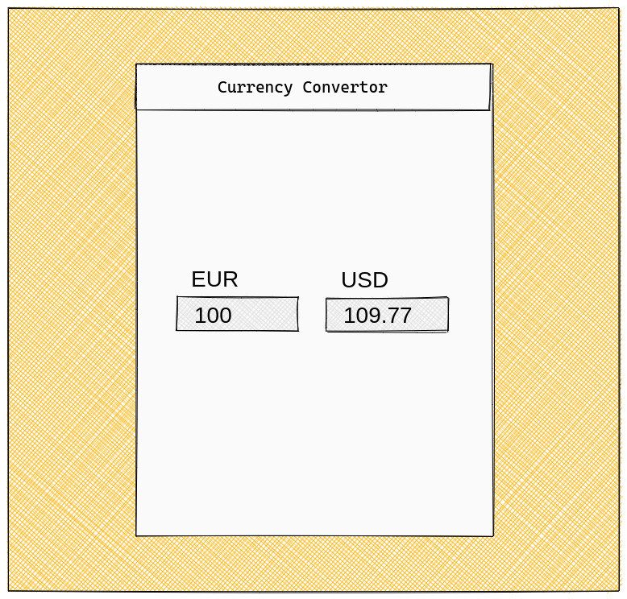
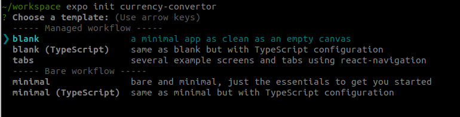

## Bored at home? Learn how to build a native app from scratch using React Native.

**In this multipart series we'll develop a native app from Scratch. We'll use [React Native](https://reactnative.dev/), since that framework allows us to create a cross platform app using one code base. Yes, that means iOS or Android, and even on the web. React Native is also quite approachable for people coming from web development in general, and from React (Dom) in particular.**

This article was written during the worldwide COVID-19 pandemic. Since many people have to stay at home right now, we can as well try to learn something new. So join me in building an app, starting from zero. Let's build a currency convertor. Although that may not be the most original idea, and not the next billion dollar thing, it's a nice project for Getting Started with app development. To see why, we'll first have a look at a rough wireframe of what we want to achieve.

That's pretty much it to begin with. We need some inputs to enter the amounts to convert from and to, which means we need to manage some state. We also need to call an external API, so we get the current exchange rates. Components, state and HTTP calls, that's what makes most of bigger frontend apps as well.

What to expect in this series? We'll have a thorough look at the code to create this app. I'll explain my reasoning behind it. But, I'll not discuss all JavaScript and React core concepts in detail. So, if you have a basic understanding of these technologies, and want to explore React Native a bit further, this is for you. You don't need deep knowledge of React or React Native though. If you need a hint on where to get up to speed, I can't recommend Kent C. Dodds [Beginner's guide to React](https://egghead.io/courses/the-beginner-s-guide-to-react) highly enough.

### Our tech stack

As mentioned, our core framework will be [React Native](https://reactnative.dev/). More specifically, we'll use [Expo](https://expo.io/). They offer nice services around the complete lifecycle of our app; from getting started over developing up to building and releasing it. We'll use [Rates API](http://ratesapi.io/) to fetch current exchange rates. I found this to be very quick and reliable service. To make it easier for us, we'll also use a library to manage the HTTP calls called [React Query](https://github.com/tannerlinsley/react-query). That gives us hooks for fetching and caching the data from the API service. Later on we'll add [React Navigation](https://reactnavigation.org/) as a routing library.

The rest of this article is about setting our development environment up. So if you've used expo before, you can skip to the next part in this series (if you're reading from the future and the next part is already published).

Since we decided to use Expo, we don't have to install too much. We don't need to setup Apples' Xcode or the Android studio dev tools. We even can develop the iOS app without using an macOS based machine.

Ok, what do we need? Firstly, NodeJS and its' package manager npm, both of them can be installed following their [recommended download](https://nodejs.org/en/). Choose the latest LTS release, it'll install both NodeJs and npm. Secondly, we'll need the Expo CLI tools. Get them using npm on your terminal/console: `npm install expo-cli --global`. To help during development, Expo offers client apps for [iOS](https://itunes.apple.com/app/apple-store/id982107779) or [Android](https://play.google.com/store/apps/details?id=host.exp.exponent). You can use these on your devices to run your app during development. In case you get stuck, read more on Expos' [documentation](https://docs.expo.io/versions/v36.0.0/get-started/installation/).

That's enough to bootstrap our app: `expo init currency-convertor`. When asked, choose the 'blank' template from the 'Managed workflow section'.

After that finished, follow the steps mentioned at the end of the command output, which is basically to change to the created directory and start the app. Expo will do its' thing and give you an URL to open in the Expo client app. By the way, one of their recent additions is [web support](https://docs.expo.io/versions/v33.0.0/introduction/running-in-the-browser/). You can press `w` in the terminal running Expo to start the web build and open the app in your browser. Either way, after everything starts you'll see a pretty plain screen. Nonetheless, this is our first succesful step in our quest to write a native app. Feel free to go ahead and change the text in the `./App.js` file. You'll notice that changes are reflected in your app almost instantly. Pretty cool, right?

Congratulations, you're good to go, that's it for part one. The second part is not yet published, but will be in some days. I hope this was interesting. Follow me on [twitter](https://twitter.com/kriswep) where I'll announce the next part. Also, please leave a comment telling me your opinions.
