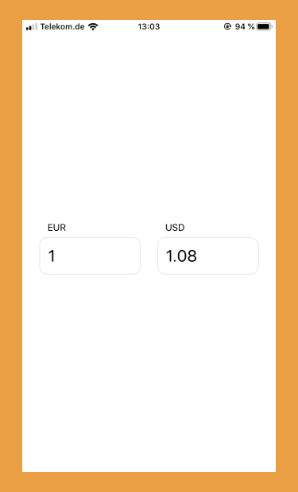

## Bored at home? Learn how to build a app from scratch using React Native.

**In this multipart series we'll develop a native app from Scratch. This second part we'll start building the main functionalities of our app. We'll be able to enter some values, fetch data and show the calculated results.**

Let's learn how to build a native app together. We'll build a currency convertor. In the [first part](../build-an-app-01/) of this series I layed out why I think this is a good example and learning app. The also started our journey by setting up our dev environment, consisting of React Native and Expo. We started with a blank Expo template. This is where we'll start from now.

Motivated? As a sneak peak, this will be today's endresult. Not too much, but it'll be fully working and will convert currencies.


### Start Building

### Fetch Data

### Done

So, we finished the main functionality of our app. We can specify currencies, enter values and see the converted amount. In the background we fetch the needed exchange rates from an external API.

This is what we have for now:

```jsx
// App.js
import React, { useState, useEffect } from 'react';
import { StyleSheet, Text, TextInput, View } from 'react-native';
import { useQuery } from 'react-query';

export default function App() {
  const [base, setBase] = useState('EUR');
  const [target, setTarget] = useState('USD');

  const [baseAmount, setBaseAmount] = useState('1');
  const [targetAmount, setTargetAmount] = useState('0');

  const { _, data, error } = useQuery(
    ['latest', base, target],
    fetchCurrencies,
  );

  useEffect(() => calculateFromBase(baseAmount), [data]);

  const calculateFromBase = number => {
    if (!isNaN(number) && data && data.rates) {
      setBaseAmount(number);
      const newTargetAmount = (number * data.rates[target]).toFixed(2);
      setTargetAmount(isNaN(newTargetAmount) ? 0 : newTargetAmount);
    }
  };
  const calculateFromTarget = number => {
    if (!isNaN(number) && data && data.rates) {
      const newBaseAmount = (number / data.rates[target]).toFixed(2);
      setBaseAmount(isNaN(newBaseAmount) ? 0 : newBaseAmount);
      setTargetAmount(number);
    }
  };

  return (
    <View style={styles.container}>
      {error && <Text>Uh Oh, an error happened...</Text>}

      <>
        <View style={styles.currencyContainer}>
          <TextInput
            autoCapitalize="characters"
            style={styles.currency}
            value={base}
            onChangeText={setBase}
          />
          <TextInput
            style={styles.currencyAmount}
            keyboardType="numeric"
            value={baseAmount}
            onChangeText={calculateFromBase}
          />
        </View>
        <View style={styles.currencyContainer}>
          <TextInput
            autoCapitalize="characters"
            style={styles.currency}
            value={target}
            onChangeText={setTarget}
          />
          <TextInput
            style={styles.currencyAmount}
            keyboardType="numeric"
            value={targetAmount}
            onChangeText={calculateFromTarget}
          />
        </View>
      </>
    </View>
  );
}

const fetchCurrencies = async (_, base, target) => {
  const res = await fetch(
    `https://api.ratesapi.io/api/latest?base=${base}&symbols=${target}`,
  );

  return await res.json();
};

const styles = StyleSheet.create({
  container: {
    flex: 1,
    flexDirection: 'row',
    backgroundColor: '#fff',
    alignItems: 'center',
    justifyContent: 'center',
  },

  currencyContainer: {
    flexBasis: 150,
    margin: 12,
  },
  currency: {
    paddingHorizontal: 12,
    paddingVertical: 6,
  },
  currencyAmount: {
    fontSize: 24,
    padding: 12,
    borderStyle: 'solid',
    borderWidth: 1,
    borderColor: '#e2e2e2',
    borderRadius: 12,
  },
});
```

Hope you could follow along. In the next part we'll do some cleaning up and introduce further components. Follow me on [twitter](https://twitter.com/kriswep) where I'll announce the next part. Also, please leave a comment telling me your opinions.
